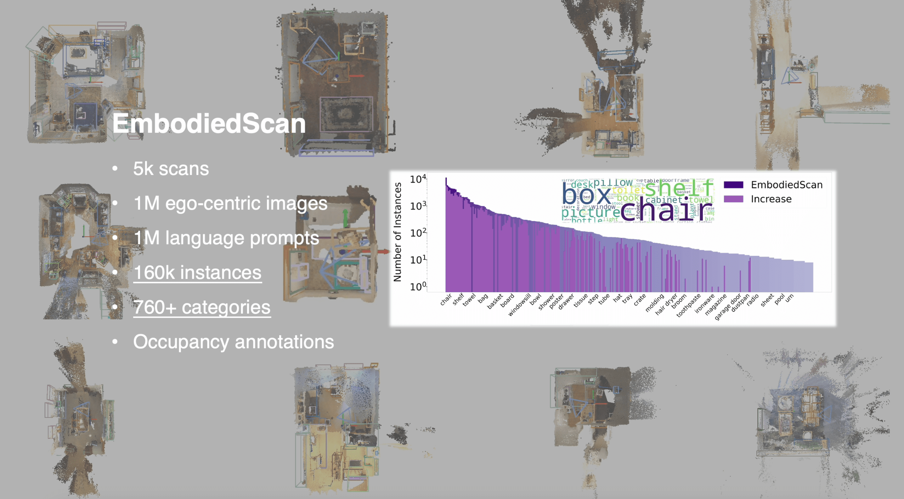
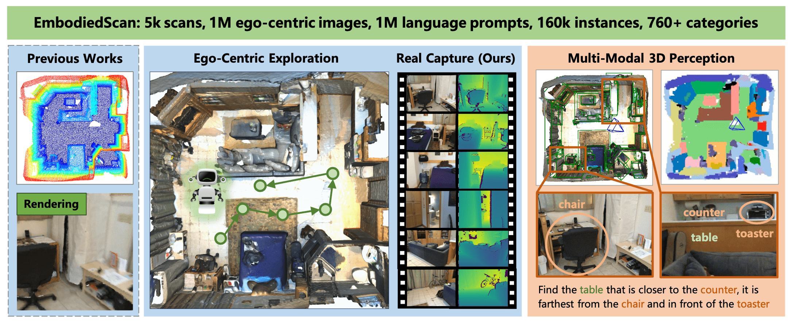
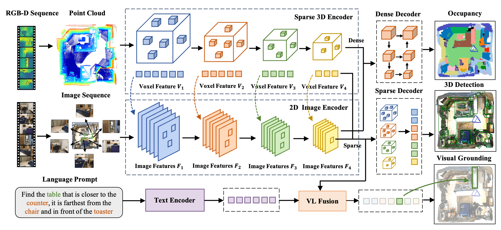

<br>
<p align="center">
<h1 align="center"><strong>EmbodiedScan: A Holistic Multi-Modal 3D Perception Suite Towards Embodied AI</strong></h1>
  <p align="center">
    <a href='https://tai-wang.github.io/' target='_blank'>Tai Wang*</a>&emsp;
    <a href='https://scholar.google.com/citations?user=-zT1NKwAAAAJ&hl=zh-CN' target='_blank'>Xiaohan Mao*</a>&emsp;
    <a href='https://scholar.google.com/citations?user=QabwS_wAAAAJ&hl=zh-CN' target='_blank'>Chenming Zhu*</a>&emsp;
    <a href='https://runsenxu.com/' target='_blank'>Runsen Xu</a>&emsp;
    <a href='https://openreview.net/profile?id=~Ruiyuan_Lyu1' target='_blank'>Ruiyuan Lyu</a>&emsp;
    <a href='https://openreview.net/profile?id=~Peisen_Li1' target='_blank'>Peisen Li</a>&emsp;
    <a href='https://xiao-chen.info/' target='_blank'>Xiao Chen</a>&emsp;
    <br>
    <a href='http://zhangwenwei.cn/' target='_blank'>Wenwei Zhang</a>&emsp;
    <a href='https://chenkai.site/' target='_blank'>Kai Chen</a>&emsp;
    <a href='https://tianfan.info/' target='_blank'>Tianfan Xue</a>&emsp;
    <a href='https://xh-liu.github.io/' target='_blank'>Xihui Liu</a>&emsp;
    <a href='https://www.mvig.org/' target='_blank'>Cewu Lu</a>&emsp;
    <a href='http://dahua.site/' target='_blank'>Dahua Lin</a>&emsp;
    <a href='https://oceanpang.github.io/' target='_blank'>Jiangmiao Pang</a>&emsp;
    <br>
    Shanghai AI Laboratory&emsp;Shanghai Jiao Tong University&emsp;The University of Hong Kong
    <br>
    The Chinese University of Hong Kong&emsp;Tsinghua University
  </p>
</p>

<!-- <p align="center">
  <a href="https://arxiv.org/abs/2312.16170" target='_blank'>
    
  </a>
  <a href="./assets/EmbodiedScan.pdf" target='_blank'>
    
  </a>
  <a href="https://tai-wang.github.io/embodiedscan" target='_blank'>
    
  </a>
</p> -->

<div id="top" align="center">

[](https://arxiv.org/abs/2312.16170)
[](./assets/EmbodiedScan.pdf)
[](https://tai-wang.github.io/embodiedscan)

</div>

## 🤖 [Demo](https://tai-wang.github.io/embodiedscan)

<!-- <div style="text-align: center;">
    
</div> -->

[](https://tai-wang.github.io/embodiedscan)

<!-- contents with emoji -->

## 📋 Contents

1. [About](#-about)
2. [News](#-news)
3. [Getting Started](#-getting-started)
4. [Model and Benchmark](#-model-and-benchmark)
5. [TODO List](#-todo-list)
6. [Citation](#-citation)
7. [License](#-license)
8. [Acknowledgements](#-acknowledgements)

## 🏠 About

<!--  -->

<div style="text-align: center;">
    
</div>
In the realm of computer vision and robotics, embodied agents are expected to explore their environment and carry out human instructions.
This necessitates the ability to fully understand 3D scenes given their first-person observations and contextualize them into language for interaction.
However, traditional research focuses more on scene-level input and output setups from a global view.
To address the gap, we introduce <b>EmbodiedScan, a multi-modal, ego-centric 3D perception dataset and benchmark for holistic 3D scene understanding.</b>
It encompasses over <b>5k scans encapsulating 1M ego-centric RGB-D views, 1M language prompts, 160k 3D-oriented boxes spanning over 760 categories, some of which partially align with LVIS, and dense semantic occupancy with 80 common categories.</b>
Building upon this database, we introduce a baseline framework named <b>Embodied Perceptron</b>. It is capable of processing an arbitrary number of multi-modal inputs and demonstrates remarkable 3D perception capabilities, both within the two series of benchmarks we set up, i.e., fundamental 3D perception tasks and language-grounded tasks, and <b>in the wild</b>.

## 🔥 News

- \[2024-02\] We will co-organize [Autonomous Grand Challenge](https://opendrivelab.com/challenge2024/) in CVPR 2024. Welcome to try the Multi-View 3D Visual Grounding track! We will release more details about the challenge with the baseline after the Chinese New Year.
- \[2023-12\] We release the [paper](./assets/EmbodiedScan.pdf) of EmbodiedScan. Please check the [webpage](https://tai-wang.github.io/embodiedscan) and view our demos!

## 📚 Getting Started

### Installation

We test our codes under the following environment:

- Ubuntu 20.04
- NVIDIA Driver: 525.147.05
- CUDA 12.0
- Python 3.8.18
- PyTorch 1.11.0+cu113
- PyTorch3D 0.7.2

1. Clone this repository.

```bash
git clone https://github.com/OpenRobotLab/EmbodiedScan.git
cd EmbodiedScan
```

2. Create an environment and install PyTorch.

```bash
conda create -n embodiedscan python=3.8 -y  # pytorch3d needs python>3.7
conda activate embodiedscan
# Install PyTorch, for example, install PyTorch 1.11.0 for CUDA 11.3
# For more information, please refer to https://pytorch.org/get-started/locally/
conda install pytorch==1.11.0 torchvision==0.12.0 torchaudio==0.11.0 cudatoolkit=11.3 -c pytorch
```

3. Install EmbodiedScan.

```bash
# We plan to make EmbodiedScan easier to install by "pip install EmbodiedScan".
# Please stay tuned for the future official release.
# Make sure you are under ./EmbodiedScan/
# This script will install the dependencies and EmbodiedScan package automatically.
python install.py all
# This command installs all of embodiedscan's dependencies,
# including the execution and visualization modules.
# If you only want to use part of the functionality,
# you can run 'python install.py run/visual' as an alternative.
```

### Data Preparation

Please refer to the [guide](data/README.md) for downloading and organization.

We will update the authorization approach and release remaining data afterward. Please stay tuned.

### Tutorial

We provide a simple tutorial [here](https://github.com/OpenRobotLab/EmbodiedScan/blob/main/embodiedscan/tutorial.ipynb) as a guideline for the basic analysis and visualization of our dataset. Welcome to try and post your suggestions!

### Demo Inference

We provide a demo for running EmbodiedScan's model on a sample scan. Please refer to the [notebook](demo/demo.ipynb) for more details.

## 📦 Model and Benchmark

We will release the code for model training and benchmark with pretrained checkpoints in the 2024 Q1.

### Model Overview

<p align="center">
  
</p>
Embodied Perceptron accepts RGB-D sequence with any number of views along with texts as multi-modal input. It uses classical encoders to extract features for each modality and adopts dense and isomorphic sparse fusion with corresponding decoders for different predictions. The 3D features integrated with the text feature can be further used for language-grounded understanding.

<!-- #### Pipeline Flow
<video src="assets/scannet_long_demo.mp4" controls>
</video>

#### Multi-objects Interaction
<video src="assets/multiobj_multistep_1.mp4" controls>
</video>
<video src="assets/multiobj_multistep_2.mp4" controls>
</video>

#### Diverse Interactions with the Same Object
<video src="assets/multistep_sit_demo.mp4" controls>
</video>
<video src="assets/multistep_bed_demo.mp4" controls>
</video>

#### ''Multi-agent'' Interaction Planned by LLMs
<video src="assets/scannet_two_bed_demo.mp4" controls>
</video> -->

### Benchmark

Please see the [paper](./assets/EmbodiedScan.pdf) for details of our two benchmarks, fundamental 3D perception and language-grounded benchmarks. This dataset is still scaling up and the benchmark is being polished and extended. Please stay tuned for our recent updates.

## 📝 TODO List

- \[x\] Release the paper and partial codes for datasets.
- \[x\] Release EmbodiedScan annotation files.
- \[x\] Release partial codes for models and evaluation.
- \[ \] Polish dataset APIs and related codes.
- \[ \] Release Embodied Perceptron pretrained models.
- \[ \] Release multi-modal datasets and codes.
- \[ \] Release codes for baselines and benchmarks.
- \[ \] Full release and further updates.

## 🔗 Citation

If you find our work helpful, please cite:

```bibtex
@article{wang2023embodiedscan,
  author={Wang, Tai and Mao, Xiaohan and Zhu, Chenming and Xu, Runsen and Lyu, Ruiyuan and Li, Peisen and Chen, Xiao and Zhang, Wenwei and Chen, Kai and Xue, Tianfan and Liu, Xihui and Lu, Cewu and Lin, Dahua and Pang, Jiangmiao},
  title={EmbodiedScan: A Holistic Multi-Modal 3D Perception Suite Towards Embodied AI},
  journal={Arxiv},
  year={2023},
```

If you use our dataset and benchmark, please kindly cite the original datasets involved in our work. BibTex entries are provided below.

<details><summary>Dataset BibTex</summary>

```BibTex
@inproceedings{dai2017scannet,
  title={ScanNet: Richly-annotated 3D Reconstructions of Indoor Scenes},
  author={Dai, Angela and Chang, Angel X. and Savva, Manolis and Halber, Maciej and Funkhouser, Thomas and Nie{\ss}ner, Matthias},
  booktitle = {Proceedings IEEE Computer Vision and Pattern Recognition (CVPR)},
  year = {2017}
}
```

```BibTex
@inproceedings{Wald2019RIO,
  title={RIO: 3D Object Instance Re-Localization in Changing Indoor Environments},
  author={Johanna Wald, Armen Avetisyan, Nassir Navab, Federico Tombari, Matthias Niessner},
  booktitle={Proceedings IEEE International Conference on Computer Vision (ICCV)},
  year = {2019}
}
```

```BibTex
@article{Matterport3D,
  title={{Matterport3D}: Learning from {RGB-D} Data in Indoor Environments},
  author={Chang, Angel and Dai, Angela and Funkhouser, Thomas and Halber, Maciej and Niessner, Matthias and Savva, Manolis and Song, Shuran and Zeng, Andy and Zhang, Yinda},
  journal={International Conference on 3D Vision (3DV)},
  year={2017}
}
```

</details>

## 📄 License

<a rel="license" href="http://creativecommons.org/licenses/by-nc-sa/4.0/"></a>
<br />
This work is under the <a rel="license" href="http://creativecommons.org/licenses/by-nc-sa/4.0/">Creative Commons Attribution-NonCommercial-ShareAlike 4.0 International License</a>.

## 👏 Acknowledgements

- [OpenMMLab](https://github.com/open-mmlab): Our dataset code uses [MMEngine](https://github.com/open-mmlab/mmengine) and our model is built upon [MMDetection3D](https://github.com/open-mmlab/mmdetection3d).
- [PyTorch3D](https://github.com/facebookresearch/pytorch3d): We use some functions supported in PyTorch3D for efficient computations on fundamental 3D data structures.
- [ScanNet](https://github.com/ScanNet/ScanNet), [3RScan](https://github.com/WaldJohannaU/3RScan), [Matterport3D](https://github.com/niessner/Matterport): Our dataset uses the raw data from these datasets.
- [ReferIt3D](https://github.com/referit3d/referit3d): We refer to the SR3D's approach to obtaining the language prompt annotations.
- [SUSTechPOINTS](https://github.com/naurril/SUSTechPOINTS): Our annotation tool is developed based on the open-source framework used by SUSTechPOINTS.
