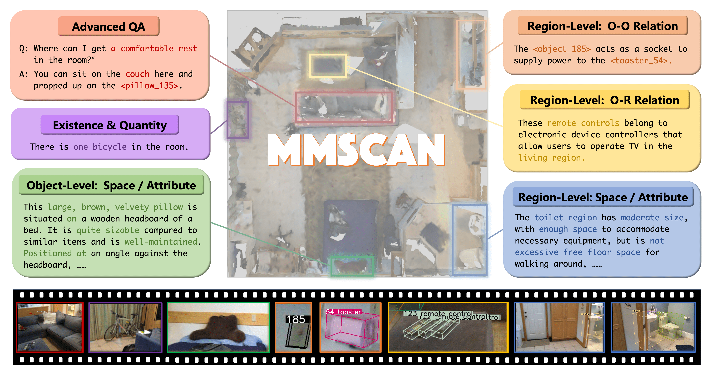

<br>
<p align="center">
<h1 align="center"><strong>MMScan: A Multi-Modal 3D Scene Dataset with Hierarchical Grounded Language Annotations</strong></h1>

</p>
</p>

<div id="top" align="center">

[](https://arxiv.org/abs/2312.16170)
[](./assets/2024_NeurIPS_MMScan_Camera_Ready.pdf)
[](https://tai-wang.github.io/mmscan)

</div>

## 🤖 [Demo](https://tai-wang.github.io/mmscan)

[](https://tai-wang.github.io/mmscan)

<!-- contents with emoji -->

## 📋 Contents

1. [About](#-about)
2. [Getting Started](#-getting-started)
3. [Model and Benchmark](#-model-and-benchmark)
4. [TODO List](#-todo-list)

## 🏠 About

<!--  -->

<div style="text-align: center;">
    
</div>

With the emergence of LLMs and their integration with other data modalities,
multi-modal 3D perception attracts more attention due to its connectivity to the
physical world and makes rapid progress. However, limited by existing datasets,
previous works mainly focus on understanding object properties or inter-object
spatial relationships in a 3D scene. To tackle this problem, this paper builds <b>the
first largest ever multi-modal 3D scene dataset and benchmark with hierarchical
grounded language annotations, MMScan.</b> It is constructed based on a top-down
logic, from region to object level, from a single target to inter-target relation
ships, covering holistic aspects of spatial and attribute understanding. The overall
pipeline incorporates powerful VLMs via carefully designed prompts to initialize
the annotations efficiently and further involve humans’ correction in the loop to
ensure the annotations are natural, correct, and comprehensive. Built upon exist
ing 3D scanning data, the resulting multi-modal 3D dataset encompasses 1.4M
meta-annotated captions on 109k objects and 7.7k regions as well as over 3.04M
diverse samples for 3D visual grounding and question-answering benchmarks. We
evaluate representative baselines on our benchmarks, analyze their capabilities in
different aspects, and showcase the key problems to be addressed in the future.
Furthermore, we use this high-quality dataset to train state-of-the-art 3D visual
grounding and LLMs and obtain remarkable performance improvement both on
existing benchmarks and in-the-wild evaluation.

## 🚀 Getting Started:

### Installation

1. Clone Github repo.

   ```shell
   git clone git@github.com:rbler1234/MMScan.git
   cd MMScan
   ```

2. Install requirements.

   Your environment needs to include Python version 3.8 or higher.

   ```shell
   conda activate your_env_name
   python intall.py all/VG/QA
   ```

   Use `"all"` to install all components and specify `"VG"` or `"QA"` if you only need to install the components for Visual Grounding or Question Answering, respectively.

### Data Preparation

1. Download the Embodiedscan and MMScan annotation. (Fill in the [form](https://docs.google.com/forms/d/e/1FAIpQLScUXEDTksGiqHZp31j7Zp7zlCNV7p_08uViwP_Nbzfn3g6hhw/viewform) to apply for downloading)

   Create a folder `mmscan_data/` and then unzip the files. For the first zip file, put `embodiedscan` under `mmscan_data/embodiedscan_split` and rename it to `embodiedscan-v1`. For the second zip file, put `MMScan-beta-release` under `mmscan_data/MMScan-beta-release` and `embodiedscan-v2` under `mmscan_data/embodiedscan_split`.

   The directory structure should be as below:

   ```
   mmscan_data
   ├── embodiedscan_split
   │   ├──embodiedscan-v1/   # EmbodiedScan v1 data in 'embodiedscan.zip'
   │   ├──embodiedscan-v2/   # EmbodiedScan v2 data in 'embodiedscan-v2-beta.zip'
   ├── MMScan-beta-release   # MMScan veta data in 'embodiedscan-v2-beta.zip'
   ```

2. Prepare the point clouds files.

   Please refer to the [guide](data_preparation/README.md) here.

## 👓 MMScan API Tutorial

The **MMScan Toolkit** provides comprehensive tools for dataset handling and model evaluation in  tasks.

To import the MMScan API, you can use the following commands:

```bash
import mmscan

# (1) The dataset tool
import mmscan.MMScan as MMScan_dataset

# (2) The evaluator tool ('VisualGroundingEvaluator', 'QuestionAnsweringEvaluator', 'GPTEvaluator')
import mmscan.VisualGroundingEvaluator as MMScan_VG_evaluator

import mmscan.QuestionAnsweringEvaluator as MMScan_QA_evaluator

import mmscan.GPTEvaluator as MMScan_GPT_evaluator
```

### MMScan Dataset

The dataset tool in MMScan allows seamless access to data required for various tasks within MMScan.

#### Usage

Initialize the dataset for a specific task with:

```bash
my_dataset = MMScan_dataset(split='train', task="MMScan-QA", ratio=1.0)
# Access a specific sample
print(my_dataset[index])
```

#### Data Access

Each dataset item is a dictionary containing key elements:

(1) 3D Modality

- **"ori_pcds"** (tuple\[tensor\]): Raw point cloud data from the `.pth` file.
- **"pcds"** (np.ndarray): Point cloud data, dimensions (\[n_points, 6(xyz+rgb)\]).
- **"instance_labels"** (np.ndarray): Instance IDs for each point.
- **"class_labels"** (np.ndarray): Class IDs for each point.
- **"bboxes"** (dict): Bounding boxes in the scan.

(2)  Language Modality

- **"sub_class"**: Sample category.
- **"ID"**: Unique sample ID.
- **"scan_id"**: Corresponding scan ID.
- **--------------For Visual Grounding Task**
- **"target_id"** (list\[int\]): IDs of target objects.
- **"text"** (str): Grounding text.
- **"target"** (list\[str\]): Types of target objects.
- **"anchors"** (list\[str\]): Types of anchor objects.
- **"anchor_ids"** (list\[int\]): IDs of anchor objects.
- **"tokens_positive"** (dict): Position indices of mentioned objects in the text.
- **--------------ForQuestion Answering Task**
- **"question"** (str): The question text.
- **"answers"** (list\[str\]): List of possible answers.
- **"object_ids"** (list\[int\]): Object IDs referenced in the question.
- **"object_names"** (list\[str\]): Types of referenced objects.
- **"input_bboxes_id"** (list\[int\]): IDs of input bounding boxes.
- **"input_bboxes"** (list\[np.ndarray\]): Input bounding boxes, 9 DoF.

(3) 2D Modality

- **'img_path'** (str): Path to RGB image.
- **'depth_img_path'** (str): Path to depth image.
- **'intrinsic'** (np.ndarray): Camera intrinsic parameters for RGB images.
- **'depth_intrinsic'** (np.ndarray): Camera intrinsic parameters for depth images.
- **'extrinsic'** (np.ndarray): Camera extrinsic parameters.
- **'visible_instance_id'** (list): IDs of visible objects in the image.

### MMScan  Evaluator

Our evaluation tool is designed to streamline the assessment of model outputs for the MMScan task, providing essential metrics to gauge model performance effectively.

#### 1. Visual Grounding Evaluator

For the visual grounding task, our evaluator computes multiple metrics including AP (Average Precision), AR (Average Recall), AP_C, AR_C, and gtop-k:

- **AP and AR**: These metrics calculate the precision and recall by considering each sample as an individual category.
- **AP_C and AR_C**: These versions categorize samples belonging to the same subclass and calculate them together.
- **gtop-k**: An expanded metric that generalizes the traditional top-k metric, offering insights into broader performance aspects.

Below is an example of how to utilize the Visual Grounding Evaluator:

```python
# Initialize the evaluator with show_results enabled to display results
my_evaluator = MMScan_VG_evaluator(show_results=True)

# Update the evaluator with the model's output
my_evaluator.update(model_output)

# Start the evaluation process and retrieve metric results
metric_dict = my_evaluator.start_evaluation()

# Optional: Retrieve detailed sample-level results
print(my_evaluator.records)

# Optional: Show the table of results
print(my_evaluator.print_result())

# Important: Reset the evaluator after use
my_evaluator.reset()
```

The evaluator expects input data in a specific format, structured as follows:

```python
[
    {
        "pred_scores" (tensor/ndarray): Confidence scores for each prediction. Shape: (num_pred, 1)

        "pred_bboxes"/"gt_bboxes" (tensor/ndarray): List of 9 DoF bounding boxes.
            Supports two input formats:
            1. 9-dof box format: (num_pred/gt, 9)
            2. center, size and rotation matrix:
                "center": (num_pred/gt, 3),
                "size"  : (num_pred/gt, 3),
                "rot"   : (num_pred/gt, 3, 3)

        "subclass": The subclass of each VG sample.
        "index": Index of the sample.
    }
    ...
]
```

#### 2. Question Answering Evaluator

The question answering evaluator measures performance using several established metrics:

- **Bleu-X**: Evaluates n-gram overlap between prediction and ground truths.
- **Meteor**: Focuses on precision, recall, and synonymy.
- **CIDEr**: Considers consensus-based agreement.
- **SPICE**: Used for semantic propositional content.
- **SimCSE/SBERT**: Semantic similarity measures using sentence embeddings.
- **EM (Exact Match) and Refine EM**: Compare exact matches between predictions and ground truths.

```python
# Initialize evaluator with pre-trained weights for SIMCSE and SBERT
my_evaluator = MMScan_QA_evaluator(model_config={}, show_results=True)

# Update evaluator with model output
my_evaluator.update(model_output)

# Start evaluation and obtain metrics
metric_dict = my_evaluator.start_evaluation()

# Optional: View detailed sample-level results
print(my_evaluator.records)

# Important: Reset evaluator after completion
my_evaluator.reset()
```

The evaluator requires input data structured as follows:

```python
[
    {
        "question" (str): The question text,
        "pred" (list[str]): The predicted answer, single element list,
        "gt" (list[str]): Ground truth answers, containing multiple elements,
        "ID": Unique ID for each QA sample,
        "index": Index of the sample,
    }
    ...
]
```

#### 3. GPT Evaluator

In addition to classical QA metrics, the GPT evaluator offers a more advanced  evaluation process.

```python
# Initialize GPT evaluator with an API key for access
my_evaluator = MMScan_GPT_Evaluator(API_key='XXX')

# Load, evaluate with multiprocessing, and store results in temporary path
metric_dict = my_evaluator.load_and_eval(model_output, num_threads=5, tmp_path='XXX')

# Important: Reset evaluator when finished
my_evaluator.reset()
```

The input structure remains the same as for the question answering evaluator:

```python
[
    {
        "question" (str): The question text,
        "pred" (list[str]): The predicted answer, single element list,
        "gt" (list[str]): Ground truth answers, containing multiple elements,
        "ID": Unique ID for each QA sample,
        "index": Index of the sample,
    }
    ...
]
```

### Models

We have adapted the MMScan API for some [models](./models/README.md).

## 📝 TODO List

- \[ \] More Visual Grounding baselines and Question Answering baselines.
- \[ \] Full release and further updates.
