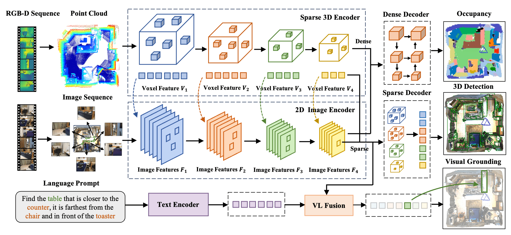

# EmbodiedScan For MMScan Visual Grounding

[EmbodiedScan](https://arxiv.org/abs/2312.16170)

## Introduction

In the original model, Embodied Perceptron accepts RGB-D sequence with any number of views along with texts as multi-modal input. It uses classical encoders to extract features for each modality and adopts dense and isomorphic sparse fusion with corresponding decoders for different predictions. The 3D features integrated with the text feature can be further used for language-grounded understanding.

To adapt to the specifications of MMScan Visual Grounding, we basically replace the ego-centric views input with point clouds to make it
consistent with other baselines. We changed its multi-view image input to point cloud and removed
its corresponding ResNet-50 backbone, reducing it to a framework similar to L3Det.

<div align=center>

</div>

## Tutorial

1. Follow the [EmbodiedScan](https://github.com/OpenRobotLab/EmbodiedScan/blob/main/README.md) to setup the environment. Download the [Multi-View 3D Detection model's weights](https://download.openmmlab.com/mim-example/embodiedscan/mv-3ddet.pth) and change the "load_from" path in the config file under `configs/grounding` to the path where the weights are saved.

2. Install MMScan API.

3. Run the following command to train EmbodiedScan (multiple GPUs):

   ```bash
   # Single GPU training
   python tools/train.py configs/grounding/pcd_4xb24_mmscan_vg_num256.py --work-dir=path/to/save

   # Multiple GPUs training
   python tools/train.py configs/grounding/pcd_4xb24_mmscan_vg_num256.py --work-dir=path/to/save --launcher="pytorch"
   ```

4. Run the following command to evaluate EmbodiedScan (multiple GPUs):

   ```bash
   # Single GPU testing
   python tools/test.py configs/grounding/pcd_4xb24_mmscan_vg_num256.py path/to/load_pth

   # Multiple GPUs testing
   python tools/test.py configs/grounding/pcd_4xb24_mmscan_vg_num256.py path/to/load_pth --launcher="pytorch"
   ```

## Results and Models

| Input Modality  | Det Pretrain | Epoch |  gTop-1 @ 0.25 | gTop-3 @ 0.25  |                           Config                           |                                                                                                                                                                 Download                                                                                                                                                                 |
| :-------:  | :----: | :----:| :----:  | :---------: | :--------------------------------------------------------: | :--------------------------------------------------------------------------------------------------------------------------------------------------------------------------------------------------------------------------------------------------------------------------------------------------------------------------------------: |
| Point Cloud   |  ✔  |  12 |  19.66 | 34.00  |    [config](configs/grounding/pcd_4xb24_mmscan_vg_num256.py)    |             [model](https://drive.google.com/file/d/1F6cHY6-JVzAk6xg5s61aTT-vD-eu_4DD/view?usp=drive_link) | [log](https://drive.google.com/file/d/1Ua_-Z2G3g0CthbeBkrR1a7_sqg_Spd9s/view?usp=drive_link)
