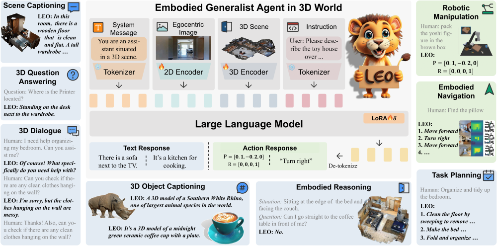

# [LEO](https://arxiv.org/abs/2311.12871) for MMScan Question Answering


## Introduction

LEO takes egocentric 2D images, 3D point clouds, and texts as input and
formulates comprehensive 3D tasks as autoregressive sequence prediction. Through instruction tuning, LEO extends the capabilities of large language models to unified multi-modal vision-language-action tasks.

<div align=center>

</div>

## Tutorial

1. Follow the [LEO](https://github.com/embodied-generalist/embodied-generalist/blob/main/README.md) to setup the environment. For data preparation, you need not load the datasets, only need to:

   (1) Download [Vicuna-7B](https://huggingface.co/huangjy-pku/vicuna-7b/tree/main) and update cfg_path in configs/llm/\*.yaml

   (2) Download the [sft_noact.pth](https://huggingface.co/datasets/huangjy-pku/LEO_data/tree/main) and store it under the `./weights` folder

2. Install MMScan API.

3. Edit the config under `scripts/train_tuning_mmscan.sh` and `scripts/test_tuning_mmscan.sh`

4. Run the following command to train LEO (4 GPUs):

   ```bash
   bash scripts/train_tuning_mmscan.sh
   ```

5. Run the following command to evaluate LEO (4 GPUs):

   ```bash
   bash scripts/test_tuning_mmscan.sh
   ```

   Optinal: You can use the GPT evaluator by this after getting the result.
   'test_embodied_scan_l_complete.json' will be generated under the checkpoint folder after evaluation and the tmp_path is used for temporarily storing.

   ```bash
   python evaluator/GPT_eval.py --file path/to/test_embodied_scan_l_complete.json
   --tmp_path path/to/tmp  --api_key your_api_key --eval_size -1
   --nproc 4
   ```

## Results and Models

| LLM  | 2D Backbone | 3D Backbone | Epoch | Overall GPT Score   |                           Config                           |                                                                                                                                                                 Download                                                                                                                                                                 |
| :-------:  | :----: | :----: | :----: |:---------: | :--------------------------------------------------------: | :--------------------------------------------------------------------------------------------------------------------------------------------------------------------------------------------------------------------------------------------------------------------------------------------------------------------------------------: |
| Vicuna7b   |  ConvNeXt | PointNet++  |  1 |  54.6     |    [config](https://drive.google.com/file/d/1CJccZd4TOaT_JdHj073UKwdA5PWUDtja/view?usp=drive_link)    |             [model](https://drive.google.com/drive/folders/1HZ38LwRe-1Q_VxlWy8vqvImFjtQ_b9iA?usp=drive_link)              |
