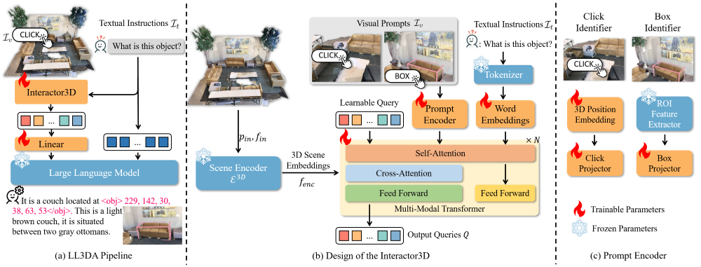

# LL3DA For MMScan Question Answering

[LL3DA](https://arxiv.org/abs/2311.18651)

## Introduction

(a) The overall pipeline of LL3DA first extracts interaction-aware 3D scene
embeddings, which are later projected to the prefix of textual instructions as the input of a frozen LLM.
(b)The detailed design of the
Interactor3D, which aggregates visual prompts, textual instructions, and 3D scene embeddings into a fixed length querying tokens. (c) The
prompt encoder encodes the user clicks and box coordinates with the positional embeddings and ROI features, respectively.

<div align=center>

</div>

## Tutorial

1. Follow the [LL3DA](https://github.com/Open3DA/LL3DA/blob/main/README.md) to setup the environment. For data preparation, you need not load the datasets, only need to:

   (1) download the [release pre-trained weights.](https://huggingface.co/CH3COOK/LL3DA-weight-release/blob/main/ll3da-opt-1.3b.pth) and put them under `./pretrained`

   (2) Download the [pre-processed BERT embedding weights](https://huggingface.co/CH3COOK/bert-base-embedding/tree/main) and store them under the `./bert-base-embedding` folder

2. Install MMScan API.

3. Edit the config under `./scripts/opt-1.3b/eval.mmscanqa.sh` and `./scripts/opt-1.3b/tuning.mmscanqa.sh`

4. Run the following command to train LL3DA (4 GPUs):

   ```bash
   bash scripts/opt-1.3b/tuning.mmscanqa.sh
   ```

5. Run the following command to evaluate LL3DA (4 GPUs):

   ```bash
   bash scripts/opt-1.3b/eval.mmscanqa.sh
   ```

   Optinal: You can use the GPT evaluator by this after getting the result.
   'qa_pred_gt_val.json' will be generated under the checkpoint folder after evaluation and the tmp_path is used for temporarily storing.

   ```bash
   python eval_utils/evaluate_gpt.py --file path/to/qa_pred_gt_val.json
   --tmp_path path/to/tmp  --api_key your_api_key --eval_size -1
   --nproc 4
   ```

## Results and Models

| Detector  | Captioner | Iters |  Overall GPT Score  |                                                                                                                                                                       Download                                                                                                                                                                 |
| :-------:  | :----: | :----: | :---------: |:--------------------------------------------------------------------------------------------------------------------------------------------------------------------------------------------------------------------------------------------------------------------------------------------------------------------------------------: |
| Vote2Cap-DETR   |  LL3DA  |  100k |  45.7     |             [model](https://drive.google.com/file/d/1mcWNHdfrhdbtySBtmG-QRH1Y1y5U3PDQ/view?usp=drive_link) | [log](https://drive.google.com/file/d/1VHpcnO0QmAvMa0HuZa83TEjU6AiFrP42/view?usp=drive_link)             |
