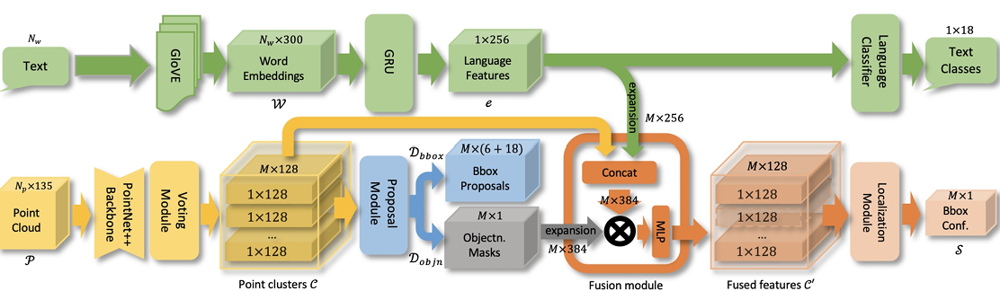

# ScanRefer for MMScan Visual Grounding

[ScanRefer](https://arxiv.org/abs/1912.08830)

## Introduction

The PointNet++ backbone takes as input a
point cloud and aggregates it to high-level point feature maps, which are then
clustered and fused as object proposals by a voting module. Object proposals are masked by the objectness predictions, and then
fused with the sentence embedding of the input descriptions, which is obtained
by a GloVE  + GRU embedding.

For MMScan Visual Grounding task, to fit the
oriented 3D box output, we add a 6D rotation representation into original regression targets and use
a disentangled Chamfer Distance (CD) loss for eight corners to supervise it.

<div align=center>

</div>

## Tutorial

1. Follow the [ScanRefer](https://github.com/daveredrum/ScanRefer/blob/master/README.md) to setup the environment. For data preparation, you need not load the datasets, only need to download the [preprocessed GLoVE embeddings](https://kaldir.vc.in.tum.de/glove.p) (~990MB) and put them under `data/`

2. Install MMScan API.

3. Overwrite the `lib/config.py/CONF.PATH.OUTPUT` to your desired output directory.

4. Run the following command to train ScanRefer (one GPU):

   ```bash
   python -u scripts/train.py --use_color --epoch {10/25/50}
   ```

5. Run the following command to evaluate ScanRefer (one GPU):

   ```bash
   python -u scripts/train.py --use_color --eval_only --use_checkpoint "path/to/pth"
   ```

## Results and Models

| Epoch |   gTop-1 @ 0.25|gTop-1 @0.50  |                           Config                           |                                                                                                                                                                 Download                                                                                                                                                                 |
| :-------:   | :---------:| :---------: | :--------------------------------------------------------: | :--------------------------------------------------------------------------------------------------------------------------------------------------------------------------------------------------------------------------------------------------------------------------------------------------------------------------------------: |
| 50 |  4.74 | 2.52    |    [config](https://drive.google.com/file/d/1iJtsjt4K8qhNikY8UmIfiQy1CzIaSgyU/view?usp=drive_link)    |             [model](https://drive.google.com/file/d/1C0-AJweXEc-cHTe9tLJ3Shgqyd44tXqY/view?usp=drive_link) | [log](https://drive.google.com/file/d/1ENOS2FE7fkLPWjIf9J76VgiPrn6dGKvi/view?usp=drive_link)
